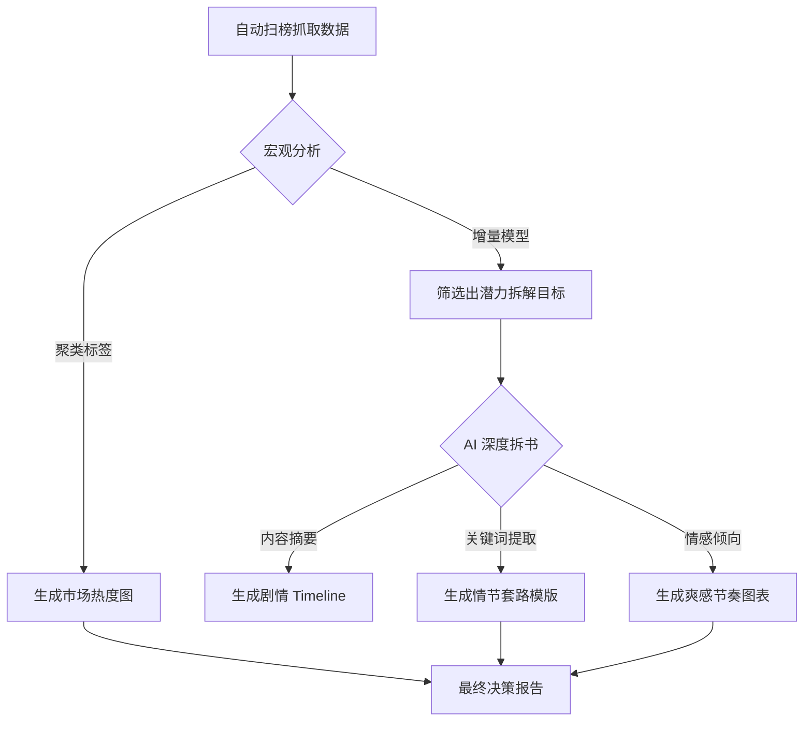

# 小说分析方法论：从宏观扫榜到微观拆书

> [!NOTE]
> 本文档旨在指导如何通过数据与 AI 技术，建立一套从小说的“市场发现”到“创作公式解析”的闭环分析体系。

---

## 核心视角对比

| 维度 | 角色 | 核心目的 | 解决的问题 |
| :--- | :--- | :--- | :--- |
| **宏观扫榜 (Market Scouting)** | 指南针 & 过滤器 | 发现流量红利、监测市场动态 | **“写什么能赚钱？”** |
| **微观拆书 (Deep Deconstruction)** | 操作手册 & 模版 | 解析爽感公式、拆解情节逻辑 | **“怎么写能留住人？”** |

---

## 一、 宏观扫榜：捕获市场“最大公约数”

扫榜的核心并非阅读，而是**特征统计与趋势建模**。

### 1. 核心监测指标
- **题材占比与流派迁移**：
    - 统计分类（如：玄幻、都市、末世）在榜单前 500 的实时权重。
    - 捕捉“新流派”的萌芽（如：从传统兵王转向退婚流后再转向荒岛模拟流）。
- **增量排名分析 (Velocity)**：
    - **不仅仅看绝对排名**：重点关注在 72 小时内由长尾冲向头部的“黑马书”。
    - 这些书往往包含了最新的读者情绪钩子。
- **核心元素 (Tropes) 词云**：
    - 提取书名、简介、标签中的高频词（如：长生、满级、听劝、逆徒）。
    - 识别当前的情绪母题：是“复仇打脸”还是“平民逆袭”？
- **更新稳定性与留存表现**：
    - 监测作品的日更动力。断更率高的题材通常意味着创作难度极高或受众窄，需慎入。

### 2. 宏观分析的价值：指路明灯
- **避坑指标**：识别处于衰退期的题材，避免在红海中硬碰硬。
- **题材溢价**：寻找那些“低竞争、高增长”的缝隙市场。

---

## 二、 微观拆书：解析创作“底层逻辑”

拆书是为了将优秀的文学体验转化为**可执行、可复制的创作公式**。

### 1. 黄金三章与核心钩子 (Hooks)
- **开篇冲突位**：第一章第几段交代主角困境？是外因驱动还是内因驱动？
- **金手指 (Cheat Code) 设定**：
    - **获取方式**：奇遇、系统、重生知识库。
    - **逻辑限制**：金手指必须有“代价”或“升级条件”，否则后期战力必然崩坏。
- **高潮位密度**：记录第一个爽点出现的页码（字数）。顶级通俗小说的爽感延迟极低。

### 2. 情节节奏控制 (Pacing)
- **情绪曲线分析**：
    - 绘制主角的“压抑（打压）- 爆发（反抗）- 释放（爽点）”循环图。
    - 统计每个循环的时间跨度（字数）。
- **悬念管理**：
    - 分析章末钩子。是利用“反转悬念”还是“利益期待”驱动读者点下一章？

### 3. 人设与人物关系图谱
- **主角画像 (Archetypes)**：性格标签化（果断、腹黑、稳健等）。当前读者的偏好是“不吃亏”型。
- **反派效能**：反派是否智商在线？给主角造成的压力是否真实？

---

## 三、 基于 AI 的自动化分析路径

结合 `novel-splitter` 开发，以下是 AI 模型（如 LLM）在分析中的落地建议：

### 1. 技术实现：自动化分析工作流

### 2. AI 重点抓取的结构化指标 (Prompts 核心)
- **关键节点提取**：提取主角每一次等级（地位）晋升的关键支点。
- **人际互动频率分析**：自动识别核心配角，判断是否有重复人设。
- **写作风格提取**：通过 AI 模仿某本书的语感和措辞习惯。

---

## 总结：工业化创作的完整闭环

**宏观不仅是看热闹，微观不仅是看细节。**
真正的专业创作者（或开发者）应当做到：
1. **宏观扫榜决定“方向”**：确认赛道是否拥挤，天花板有多高。
2. **微观拆书决定“质量”**：掌握留住读者的手艺和钩子。
3. **AI 工具实现“效率”**：将繁复的数据统计和长文本阅读转化为直观的可视化指标。

---
*文档生成于：2026-03-26*
